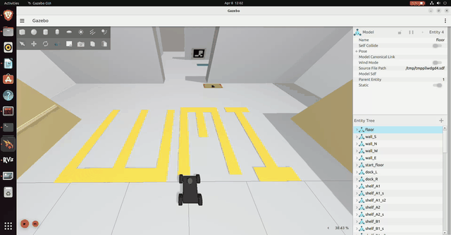
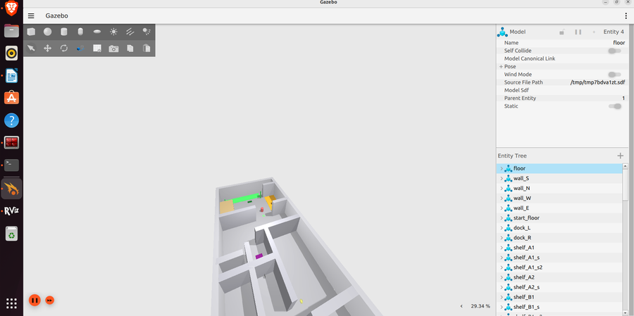
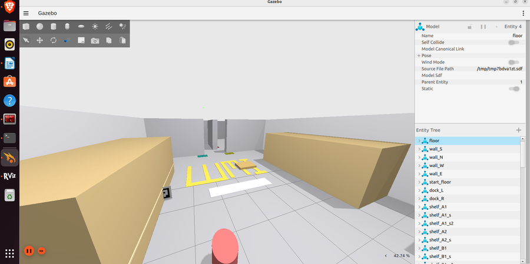
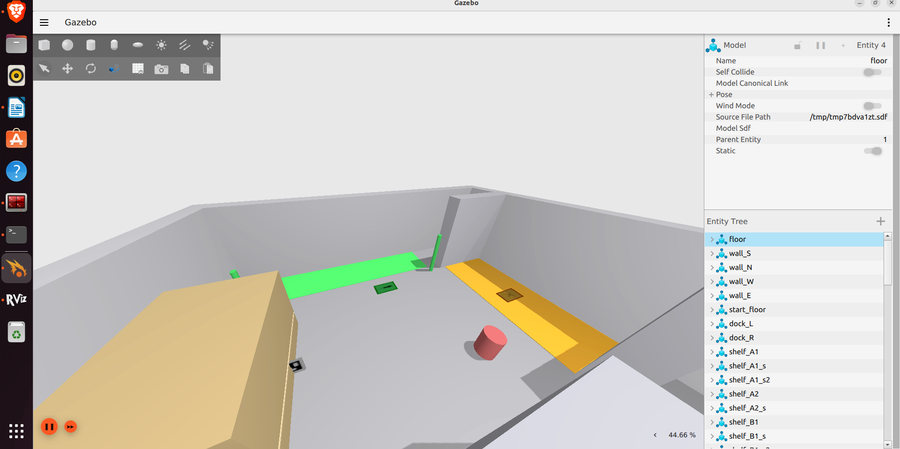
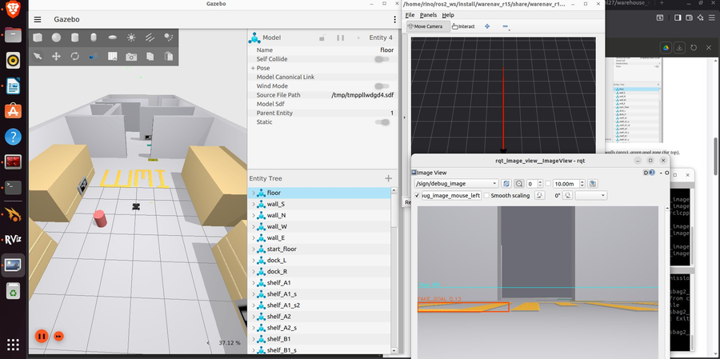
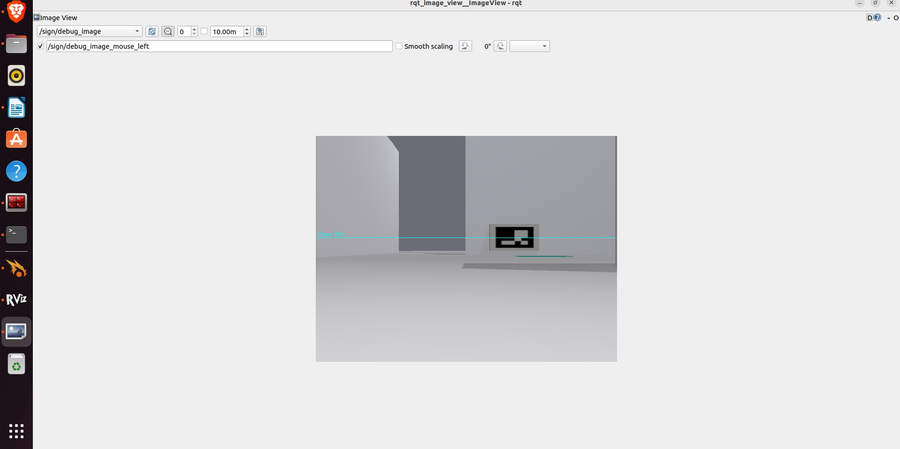
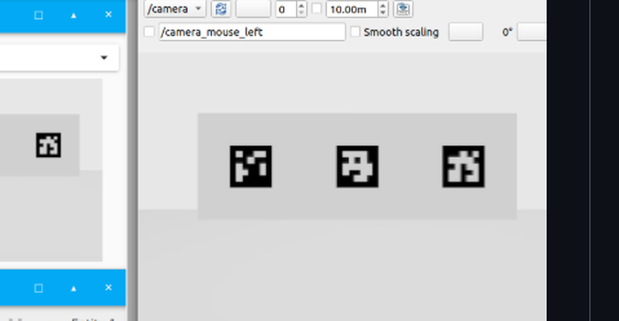

# LUMI — Autonomous Warehouse Navigation AMR

**MAHE Mobility Challenge 2026 | Round 1.5 | by Rino | GMIT Mandya**



> Map-less autonomous navigation · ArUco detection · ROS 2 Humble · Gazebo Fortress

---

## What LUMI Does

LUMI is a fully autonomous mobile robot that:
1. Starts at the warehouse loading dock
2. Explores shelf rows using LiDAR reactive navigation
3. Detects all 4 ArUco inventory markers (IDs 0–3) using camera + OpenCV
4. Navigates through an S-curve maze section
5. Avoids the false goal trap
6. Reaches the true dispatch zone

**No SLAM. No pre-built map. No hardcoded positions.**

---

## Simulation Screenshots

| Arena Overview | Main Aisle |
|:---:|:---:|
|  |  |

| Goal Zone | Live Run |
|:---:|:---:|
|  |  |

| Camera View (ArUco detected) | Generated ArUco Markers |
|:---:|:---:|
|  |  |

---

## Arena Layout

```
y=28-30  ╔═════════════════════╗  ← TRUE GOAL (green floor)
         ║   DISPATCH ZONE     ║
y=24-28  ╠════════╦════════════╣
         ║ Shelf  ║ FAKE GOAL  ║  ← ArUco 3 on shelf D1
         ║  D1    ║ (orange)   ║
y=15-24  ╠════════╩════════════╣  ← MAZE (S-curve, 5m corridors)
         ║  Wall1 ── Wall2     ║  ← ArUco 2 on maze wall
         ║  ← → corridors     ║
y=13-15  ╠═══════╦═════════════╣  ← INTERSECTION
         ║ TRAP  ║  CORRECT →  ║  LEFT=dead-end, CENTER=correct
y=2-14   ╠═══════╩═════════════╣  ← MAIN AISLE
         ║ A1/A2 ║ B1/B2      ║  ArUco 0 on A2, ArUco 1 on B1
y=0-2    ╠═════════════════════╣  ← START ZONE (green floor)
         ║   LOADING DOCK  🤖  ║  Robot spawns at (0, 0.5)
         ╚═════════════════════╝
              x=-5      x=5
```

---

## ArUco Markers

| ID | Shelf | Position (x, y, z) | Faces | Detection dist |
|:--:|:-----:|:-------------------:|:-----:|:--------------:|
| 0 | A2 left face | (−2.95, 9.5, 0.55) | +X | 1.55m |
| 1 | B1 right face | (+2.95, 4.5, 0.55) | −X | 1.55m |
| 2 | Maze wall | (−1.0, 17.7, 0.55) | −Y (south) | 2.7m |
| 3 | D1 left face | (−2.95, 26.5, 0.55) | +X | 1.55m |

---

## Robot State Machine

```
INIT ──5s──► EXPLORE ──zone entry──► DRIFT_TO_SHELF
                ▲                          │
                │                    ArUco seen
                │                          ▼
              LOG ◄──close enough── APPROACH_ARUCO
                │
           all 4 found
                │
                ▼
         HEADING_TO_GOAL ──y>28.5──► GOAL_REACHED ──► DONE

   STUCK >8s triggers:
   RECOVERY_ROTATE (360°) or RECOVERY_BACK (reverse+turn)
```

---

## Setup

### Prerequisites
```bash
sudo apt install -y \
  ros-humble-ros-gz-sim ros-humble-ros-gz-bridge \
  ros-humble-nav2-bringup ros-humble-robot-localization \
  ros-humble-twist-stamper ros-humble-cv-bridge \
  ros-humble-teleop-twist-keyboard python3-opencv
```

### Build
```bash
mkdir -p ~/ros2_ws/src
cp -r mini_r1_v1_description mini_r1_v1_gz warenav_r15 ~/ros2_ws/src/
cd ~/ros2_ws
rosdep install --from-paths src --ignore-src -r -y
colcon build --symlink-install
source install/setup.bash
```

### Run
```bash
# Autonomous mode
ros2 launch warenav_r15 r15_challenge.launch.py

# With keyboard override
ros2 launch warenav_r15 r15_challenge.launch.py use_teleop:=true
```

### Monitor
```bash
# Terminal 1 — mission progress
ros2 topic echo /mission_status

# Terminal 2 — live camera with ArUco overlay
ros2 run rqt_image_view rqt_image_view /aruco/debug_image

# Terminal 3 — sign detector view
ros2 run rqt_image_view rqt_image_view /sign/debug_image
```

---

## Launch Sequence

| Time | Event |
|:----:|:------|
| t = 0s | Gazebo loads world + robot state publisher |
| t = 5s | MINI R1 spawns at (0, 0.5) facing north + bridge starts |
| t = 9s | EKF starts: odom + IMU → /odometry/filtered |
| t = 14s | Nav2: local costmap + MPPI planner |
| t = 19s | ArUco detector + Sign detector start |
| t = 22s | Mission controller launched |
| **t = 27s** | **Robot begins autonomous exploration** |

---

## Key Technical Details

### Camera Intrinsics
```
hFOV = 1.089 rad (62.4°)     Resolution = 640 × 480
fx = fy = 320 / tan(0.5445) = 534.6 px    ← critical, not default 554
Camera height = 0.07 + 0.078 = 0.148m above ground
ArUco visible from: 0.89m to 3.8m
```

### 8-Sector LiDAR
```
Sectors: F, FL, FR, L, R, BL, BR, B
eff_front = min(F, FL×0.70, FR×0.70)
Speed tiers:
  eff < 0.40m → stop + spin
  eff < 0.70m → v=0.07 m/s + steer
  eff < 1.10m → v=0.16 m/s + correct
  eff ≥ 1.10m → v=0.28 m/s + wall-follow
```

### Critical Fixes
| Bug | Cause | Fix |
|:---|:---|:---|
| No camera images | QoS mismatch | BEST_EFFORT on all sensor subs |
| Robot frozen | use_sim_time on mission_controller | Remove use_sim_time from mission |
| Wrong bearing | fx=554 (incorrect) | fx=534.6 from hFOV=1.089 |
| ArUco 2 invisible | yaw=0 faces east | yaw=π faces south (toward robot) |
| Robot not spawning | Spawn before Gazebo ready | Delay spawn to t=5s |
| Build fails | obstacle_detector.py in CMakeLists | Remove non-existent file |

---

## Scoring (MAHE Guidelines)

| Criterion | Max | Status |
|:---|:---:|:---:|
| ArUco detection (4/4) | 30 | ✅ |
| Correct navigation decisions | 20 | ✅ |
| Maze completion | 15 | ✅ |
| Loop avoidance | 10 | ✅ |
| Time efficiency | 15 | ✅ |
| Motion smoothness | 10 | ✅ |
| **Total** | **100** | |

---

## Package Structure

```
warenav_r15/
├── warenav_r15/
│   ├── mission_controller.py   # State machine explorer
│   ├── aruco_detector.py       # OpenCV ArUco + HUD overlay
│   └── sign_detector.py        # HSV floor sign detector
├── worlds/world_template.sdf   # Custom warehouse arena
├── config/
│   ├── ekf_r15.yaml            # EKF: odom + IMU
│   └── nav2_mapless.yaml       # Nav2: local costmap + MPPI
├── launch/r15_challenge.launch.py
├── rviz/r15.rviz
└── images/
    ├── aruco/aruco_0-3.png     # Generated ArUco textures
    └── signs/                  # Floor sign PNG textures
```

---

## Round 1 Summary

**Problem:** Warehouse inventory audits take 8–12 hours manually.

**Solution:** Fully autonomous AMR using:
- LiDAR reactive navigation (no SLAM)
- Camera ArUco detection (shelf inventory markers)
- Floor sign interpretation (directional guidance)
- EKF sensor fusion (odom + IMU)

**Stack:** ROS 2 Humble · Gazebo Fortress · Nav2 · OpenCV · Python 3.10

---

## Team

**LUMI** — GMIT Mandya, Karnataka, India
**Event:** MAHE Mobility Challenge 2026, powered by ARTPARK @ IISc Bengaluru

---

*Built with ❤️ using ROS 2 Humble · Gazebo Fortress · OpenCV · Nav2*
